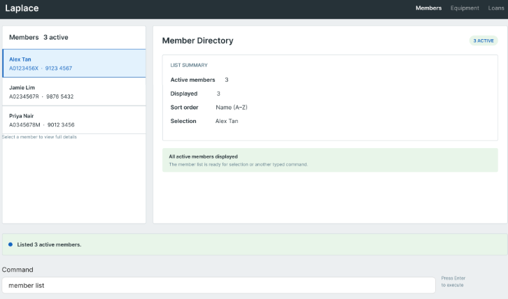

# Laplace

* It is named Laplace under the famous [Laplace Demon](https://en.wikipedia.org/wiki/Laplace%27s_demon) that knows the exact information of all observable details in the universe. So CCA leaders will be able to manage everything with the help of Laplace.
* For the detailed documentation of this project, see the **[Laplace Product Website](https://ay2627s1-cs2103t-f15-2.github.io/tp/)**.
* If you would like to know more about us, click [here](https://ay2627s1-cs2103t-f15-2.github.io/tp/AboutUs.html)

## Acknowledgments
This project is based on the AddressBook-Level3 project created by the [SE-EDU initiative](https://se-education.org).
